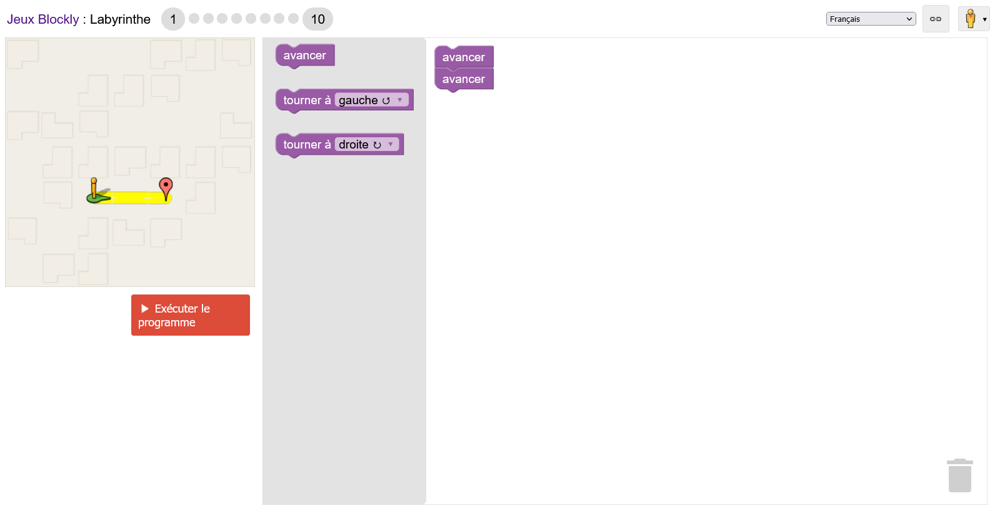
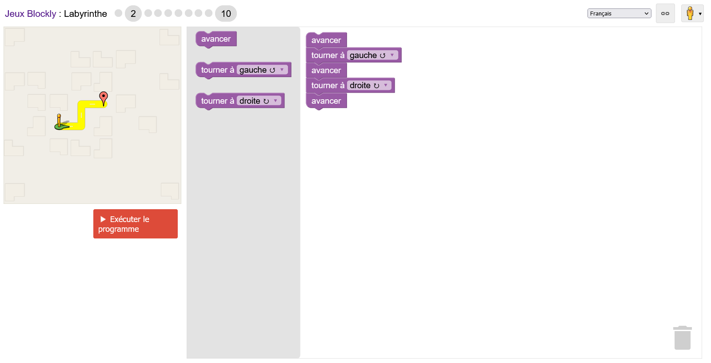
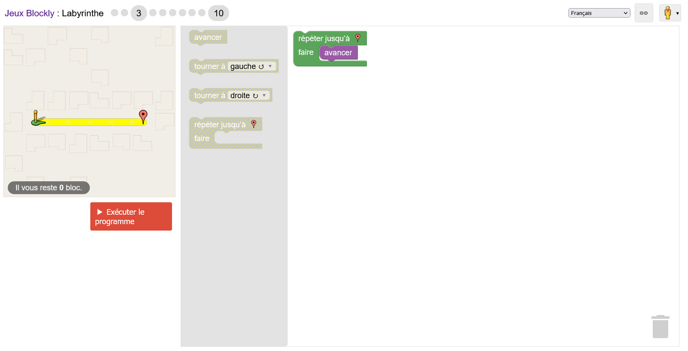
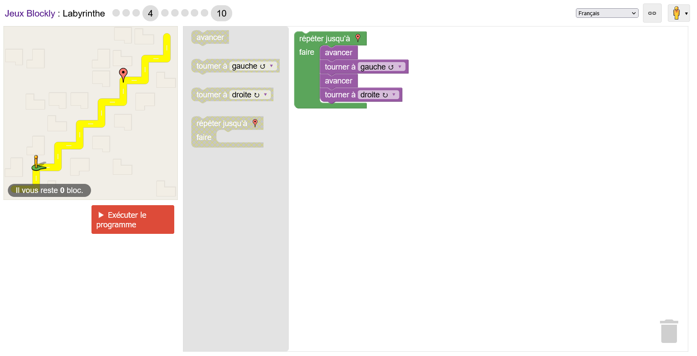
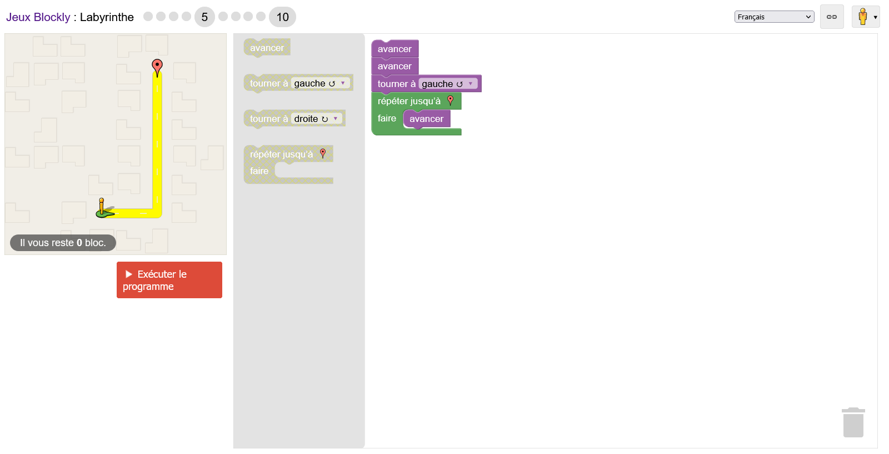
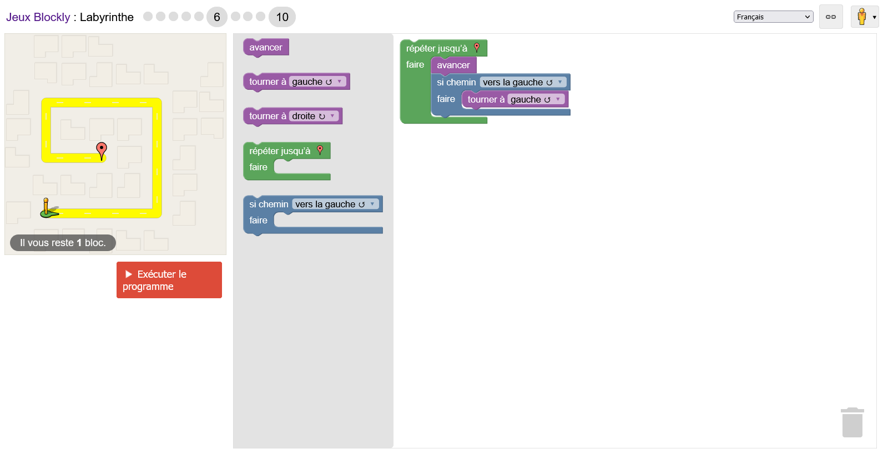
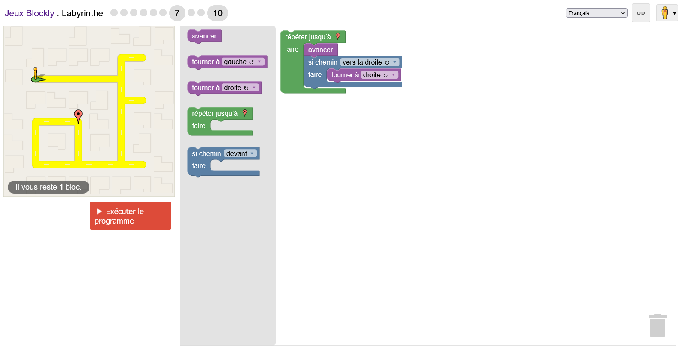
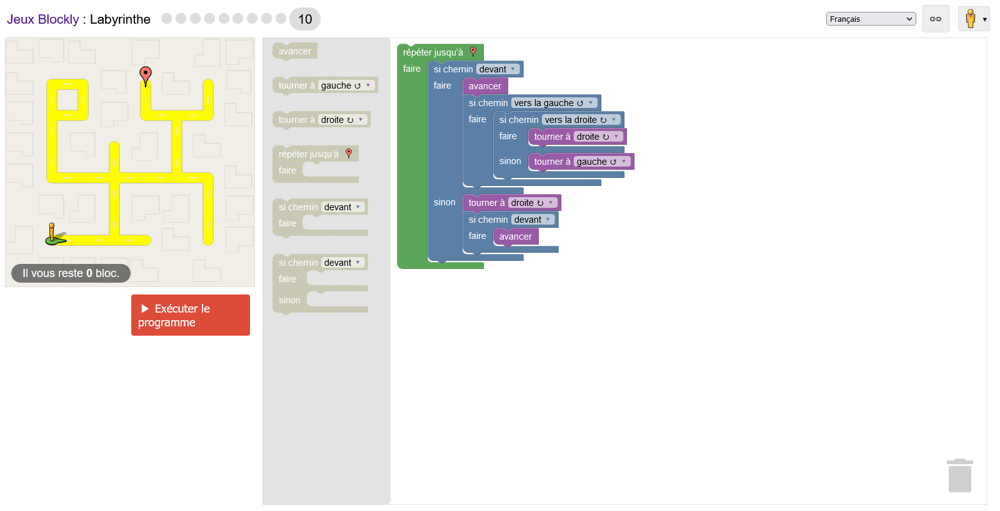

# Correction jeux Blocky : Labyrinthe

[Lien du jeu](https://blockly.games/maze?lang=fr)

---

## Niveau 1

---

## Niveau2

---

## Niveau 3

---

## Niveau 4

---

## Niveau 5

---

## Niveau 6

---

## Niveau 7

---

## Niveau 8

---

## Niveau 9

---

## Niveau 10

**PS : ce n'est pas la solution la plus optimisé, ici on emprunte le chémin le plus court. Pour avoir moins de bloc de code, il faut emprunter le chémin le plus long.**

