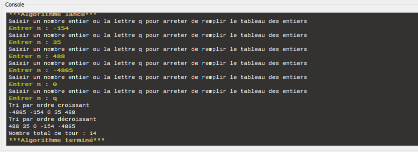

# Exercice 9 : tri

---

## Modalités

- Résolvez les algorithmes avec le langage ***JavaScript***.
- **Vous ne devez pas utiliser les fonctions de tri déjà existantes proposées par votre langage de programmation**.

---

## Programme à réaliser

1. Écrivez un programme qui prend en entrée des entiers puis en sortie les tris par ordre croissant.
- Offrir à l'utilisateur la possibilité de rentrer plusieurs nombres les uns après les autres puis lui permettre d'arrêter la saisie après avoir entré la lettre `q` pour quitter.
- Affichez le nombre de tour effectué par votre algorithme pour effectuer le tri.
- Affichez les nombres triés dans l'ordre croissant.
- Par déduction, sans refaire le tri, affichez les nombres triés par ordre décroissant.

### Exemple du scénario attendu

